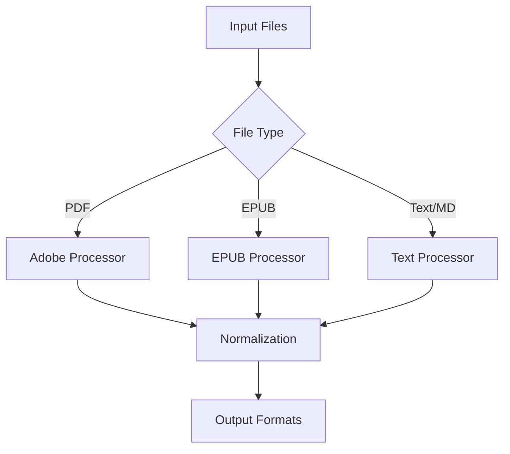
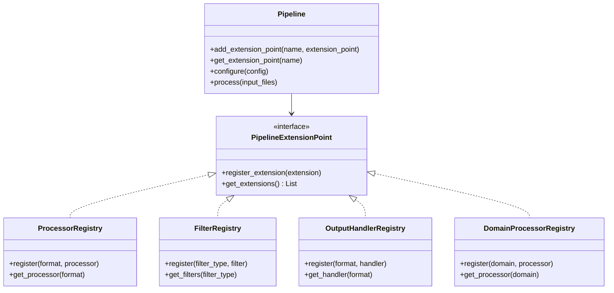

# ADR-001: Modular Pipeline Architecture

## Context
Need to process multiple file types (PDF/EPUB/Markdown/Text) through configurable stages while maintaining existing Adobe PDF integration.

## Decision
Implement microkernel architecture with:
- Core pipeline manager
- Plugin processors per file type
- Shared normalization interface



### Plugin Architecture Extension

Enhance the architecture with a comprehensive extension system:



### Extension Points

1. **InputProcessors**: Format-specific document processors
   ```python
   pipeline.register_extension("processors.pdf", PDFProcessor())
   pipeline.register_extension("processors.epub", EPUBProcessor())
   pipeline.register_extension("processors.markdown", MarkdownProcessor())
   ```

2. **ContentFilters**: Content transformation and filtering
   ```python
   pipeline.register_extension("filters.non_content", NonContentFilter())
   pipeline.register_extension("filters.footnotes", FootnoteHandler())
   pipeline.register_extension("filters.structure", StructurePreserver())
   ```

3. **OutputHandlers**: Output format writers
   ```python
   pipeline.register_extension("outputs.markdown", MarkdownWriter())
   pipeline.register_extension("outputs.text", TextWriter())
   pipeline.register_extension("outputs.semantic", SemanticWriter())
   ```

4. **DomainProcessors**: Domain-specific content transformations
   ```python
   pipeline.register_extension("domains.semantic_search", SemanticSearchProcessor())
   pipeline.register_extension("domains.audiobook", AudiobookProcessor())
   ```

5. **AnalysisComponents**: Content analysis modules
   ```python
   pipeline.register_extension("analysis.entities", EntityExtractor())
   pipeline.register_extension("analysis.complexity", ComplexityAnalyzer())
   pipeline.register_extension("analysis.sections", SectionClassifier())
   ```

## Status
Proposed

## Consequences
- (+) Modular architecture enables format extensions
- (+) Leverages existing Adobe integration
- (+) Highly extensible for new formats, filters, and output types
- (+) Clean separation of concerns
- (+) Supports test-driven development with mockable components
- (-) Requires interface standardization
- (-) Initial development complexity
- (-) Need for careful extension point design
- (-) Potential performance overhead from plugin indirection

## Implementation Notes

### Core Pipeline Implementation

```python
class Pipeline:
    def __init__(self):
        self._extension_points = {}
        
    def add_extension_point(self, name, extension_point):
        """Register a new extension point"""
        self._extension_points[name] = extension_point
        
    def get_extension_point(self, name):
        """Get an extension point by name"""
        return self._extension_points.get(name)
        
    def configure(self, config):
        """Configure the pipeline from configuration"""
        for name, ext_point in self._extension_points.items():
            if name in config:
                ext_point.configure(config[name])
                
    def process(self, input_files):
        """Process input files through the pipeline"""
        results = []
        for file in input_files:
            # Determine file type
            processor = self._get_processor_for_file(file)
            
            # Extract content
            content = processor.process(file)
            
            # Apply filters
            filtered_content = self._apply_filters(content)
            
            # Generate outputs
            outputs = self._generate_outputs(filtered_content)
            
            # Apply domain-specific processing
            domain_outputs = self._apply_domain_processors(filtered_content)
            
            results.append({
                'file': file,
                'outputs': outputs,
                'domain_outputs': domain_outputs
            })
            
        return results
        
    def _get_processor_for_file(self, file):
        """Get appropriate processor for file type"""
        processors = self.get_extension_point('processors')
        file_type = self._determine_file_type(file)
        return processors.get_processor(file_type)
        
    def _apply_filters(self, content):
        """Apply all registered filters to content"""
        filters = self.get_extension_point('filters')
        filtered_content = content
        for filter_obj in filters.get_filters():
            filtered_content = filter_obj.apply(filtered_content)
        return filtered_content
        
    def _generate_outputs(self, content):
        """Generate all configured output formats"""
        outputs = self.get_extension_point('outputs')
        results = {}
        for format_name, writer in outputs.get_handlers().items():
            results[format_name] = writer.write(content)
        return results
        
    def _apply_domain_processors(self, content):
        """Apply domain-specific processors"""
        domain_processors = self.get_extension_point('domains')
        results = {}
        for domain_name, processor in domain_processors.get_processors().items():
            if processor.is_enabled():
                results[domain_name] = processor.process(content)
        return results
        
    def _determine_file_type(self, file):
        """Determine file type from extension or content inspection"""
        # Implementation
```

### Extension Point Implementation

```python
class ProcessorRegistry(PipelineExtensionPoint):
    def __init__(self):
        self._processors = {}
        
    def register(self, format_name, processor):
        """Register a processor for a specific format"""
        self._processors[format_name] = processor
        
    def get_processor(self, format_name):
        """Get processor for format, or default if not found"""
        return self._processors.get(format_name, self._processors.get('default'))
        
    def configure(self, config):
        """Configure all registered processors"""
        for format_name, processor in self._processors.items():
            if format_name in config:
                processor.configure(config[format_name])
```
````
