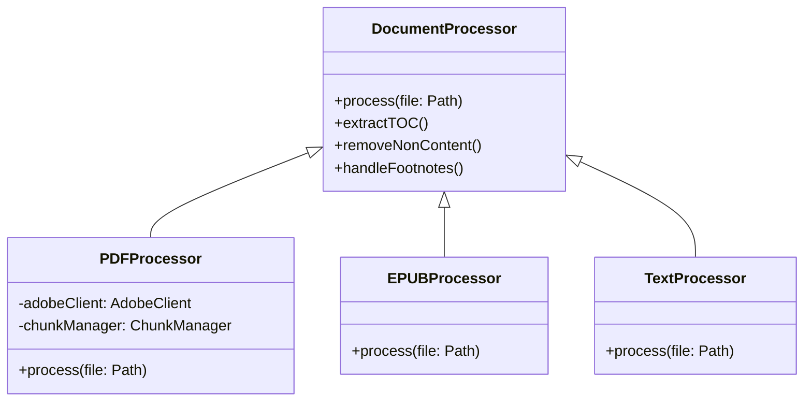
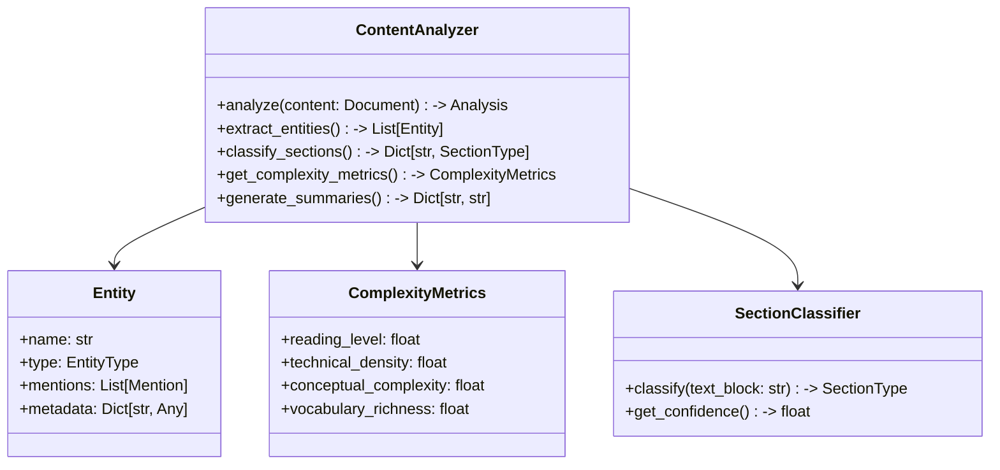

# ADR-002: File Processing Strategy

## Context

Need to process multiple document formats (PDF, EPUB, Markdown, Text) while handling:
- Adobe API limitations (page/size limits)
- Content filtering (removing non-content pages)
- Footnote handling
- Table of contents extraction

## Decision

Implement a processor factory pattern with specialized handlers:



### Key Components

1. Processor Factory
   - Determines file type
   - Creates appropriate processor instance

2. PDF Processor
   - Handles Adobe API integration
   - Manages chunking for large files
   - Extracts TOC for splitting
   - Removes non-content pages
   - Optional footnote handling

3. EPUB Processor
   - Direct content extraction
   - Optional splitting for >500k words
   - Maintains document structure

4. Text/Markdown Processor
   - Simple content normalization
   - Structure preservation
   - Optional splitting for large files

### Advanced Content Analysis

Enhance processors with content analysis capabilities:



## Status

Proposed

## Consequences

### Advantages
- Clean separation of format-specific logic
- Extensible for new formats
- Consistent interface across processors
- Independent scaling of processor implementations
- Enhanced document understanding
- Improved filtering and chunking
- Content-aware processing

### Disadvantages
- Initial setup complexity
- Potential code duplication across processors
- Need to maintain format-specific test suites
- Computational overhead for analysis
- Training data needed for classifiers

## Requirements

1. All processors must implement:
   - Content extraction
   - Structure preservation
   - Optional footnote handling
   - Non-content page filtering

2. PDF-specific:
   - Adobe API retry/error handling
   - Smart chunking based on TOC
   - Parallel processing within API limits

3. Output Format:
   - Normalized text content
   - Original structure markers
   - Metadata preservation

## Implementation Notes

1. Content Analysis Components:
   ```python
   class ContentAnalyzer:
       """Performs advanced analysis on document content"""
       
       def extract_entities(self, content):
           """Extract named entities (people, places, organizations, concepts)
           
           Uses NER techniques to identify and categorize entities
           within the document content.
           
           Returns: List of Entity objects with types and references
           """
           # Implementation
           
       def classify_sections(self, content):
           """Classify document sections by type
           
           Identifies content sections, acknowledgments, references,
           appendices, etc. based on content patterns.
           
           Returns: Dictionary mapping section ranges to types
           """
           # Implementation
           
       def get_complexity_metrics(self, content):
           """Calculate readability and complexity metrics
           
           Analyzes text to determine reading level, technical
           density, and conceptual complexity.
           
           Returns: ComplexityMetrics object
           """
           # Implementation
           
       def generate_summaries(self, content, levels=['document', 'section']):
           """Generate multi-level text summaries
           
           Creates concise summaries at document and section levels
           using extractive and abstractive techniques.
           
           Returns: Dictionary of summary texts by level
           """
           # Implementation
   ```

2. Integration with Processing Pipeline:
   ```python
   def process_document(file_path):
       processor = ProcessorFactory.get_processor(file_path)
       raw_content = processor.extract_content()
       
       analyzer = ContentAnalyzer()
       analysis = analyzer.analyze(raw_content)
       
       # Use analysis results to improve processing
       enhanced_content = ContentEnhancer.apply(
           raw_content,
           entities=analysis.entities,
           section_types=analysis.section_types,
           complexity=analysis.complexity
       )
       
       return enhanced_content
   ```