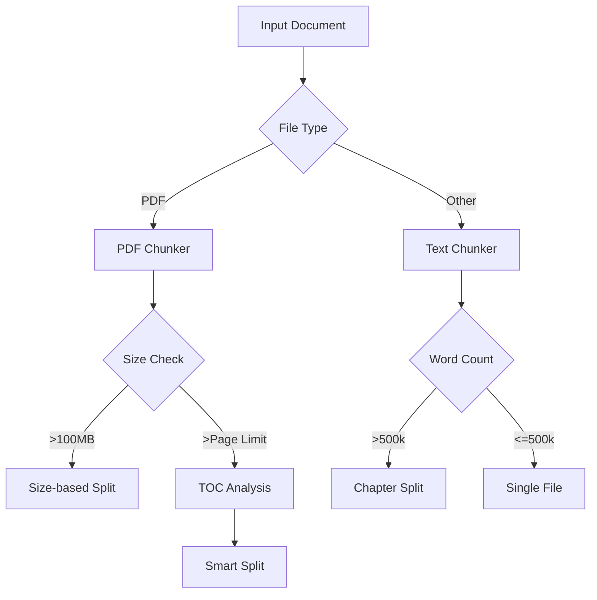
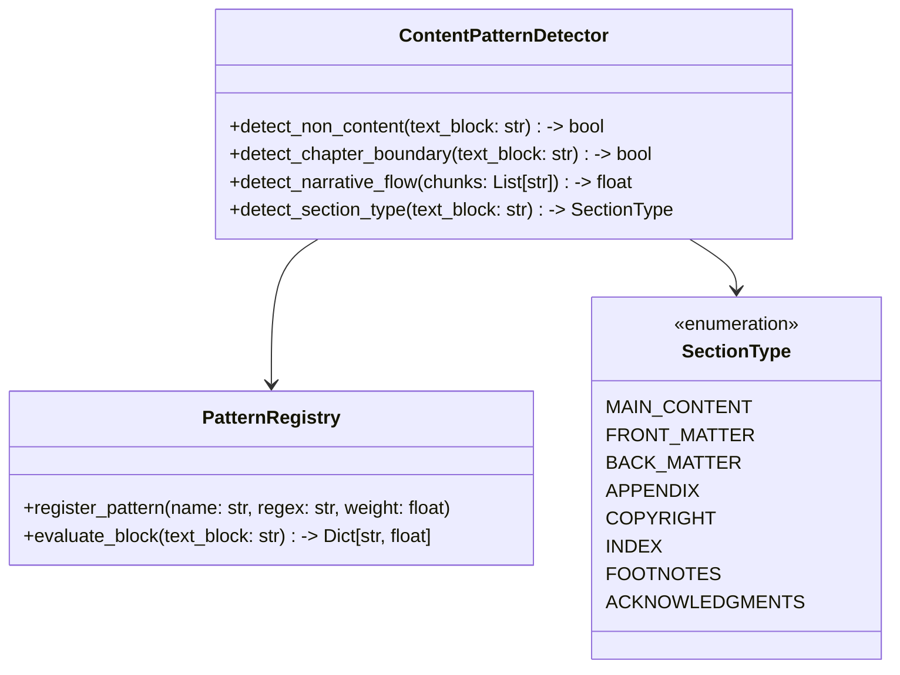

# ADR-003: Document Chunking Strategy

## Context

Adobe PDF Services API has strict limits:
- 150 pages for scanned PDFs
- 400 pages for native PDFs
- 100MB file size limit
- 25 requests/minute (standard tier)
- 5 pages per Document Transaction

Additionally, output text documents >500k words need splitting.

## Decision

Implement a multi-strategy chunking system:



### Chunking Strategies

1. PDF Documents
   ```mermaid
   graph TD
       A[Get TOC] --> B{Extract Sections}
       B --> C[Calculate Section Sizes]
       C --> D{Size > Limit?}
       D -->|Yes| E[Split Section]
       D -->|No| F[Keep Intact]
       E --> G[Maintain References]
   ```

2. Text Documents
   ```mermaid
   graph TD
       A[Count Words] --> B{>500k words?}
       B -->|Yes| C[Find Chapter Markers]
       B -->|No| D[Single Chunk]
       C --> E[Split at Chapters]
   ```

### Pattern-Based Content Detection

Add intelligent content pattern detection for improved chunking and filtering:



## Status

Proposed

## Consequences

### Advantages
- Maintains document structure
- Optimizes API usage
- Handles all format requirements
- Preserves logical sections
- Intelligently identifies content boundaries
- Filters non-relevant content
- Improves chunking quality

### Disadvantages
- Complex TOC parsing needed
- May split mid-section if limits force it
- Additional metadata management
- Pattern training may require manual tuning

## Implementation Notes

1. PDF Chunking:
   - Extract and parse TOC first
   - Calculate optimal split points
   - Maintain page reference mapping
   - Handle missing/malformed TOC

2. Text/EPUB Chunking:
   - Identify chapter markers
   - Count words per section
   - Split at natural boundaries
   - Maintain cross-references

3. Metadata Handling:
   - Track chunk relationships
   - Preserve section hierarchy
   - Enable easy reassembly
   - Store split points

4. Pattern Detection:
   ```python
   class ContentPatternDetector:
       def detect_non_content(self, text_block):
           """Identifies boilerplate text, disclaimers, etc.
           
           Uses pattern matching to identify text blocks that aren't
           part of the main content (copyright notices, etc.)
           
           Returns: bool indicating if block is non-content
           """
           # Implementation: analyze text patterns, repetitive elements,
           # formatting clues, and language markers
           pass
           
       def detect_chapter_boundary(self, text_block):
           """Uses linguistic cues to detect natural section breaks
           
           Looks for chapter headings, numbering patterns, and
           other signals of major content divisions.
           
           Returns: bool indicating if block marks a chapter boundary
           """
           # Implementation: identifies headings, numbered sections,
           # and other chapter boundary signals
           pass
           
       def detect_narrative_flow(self, chunks):
           """Ensures chunks maintain narrative coherence
           
           Analyzes consecutive chunks to ensure they maintain
           proper narrative flow when split.
           
           Returns: coherence score between 0.0-1.0
           """
           # Implementation: semantic similarity between chunk endings
           # and beginnings, references analysis, etc.
           pass
           
       def detect_section_type(self, text_block):
           """Classifies the section type
           
           Determines if a text block belongs to main content,
           front matter, back matter, etc.
           
           Returns: SectionType enum value
           """
           # Implementation: classification based on content signals,
           # location in document, and text patterns
           pass
   ```

5. Pattern-Based Splitting:
   - Use NLP techniques to identify optimal split points
   - Maintain context across chunk boundaries
   - Avoid splitting in the middle of paragraphs or sentences
   - Preserve semantic coherence between chunks