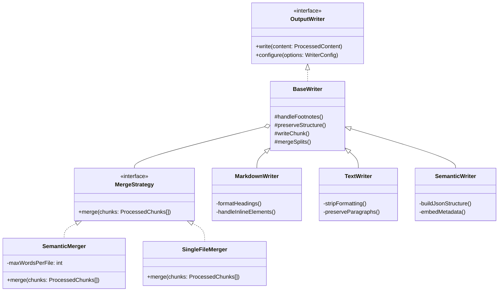
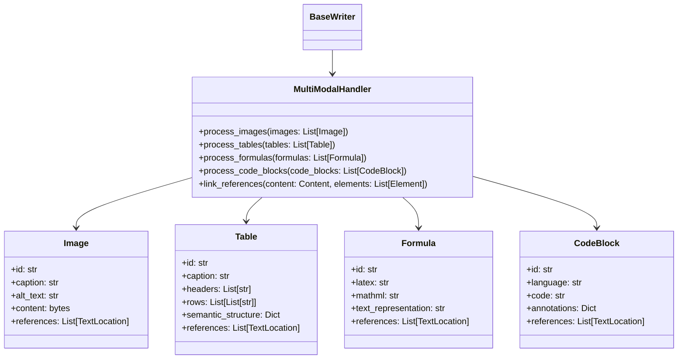

# ADR-004: Output Format Handlers

## Context

Need flexible output processing to support:
- Multiple output formats (Markdown, Text, Semantic JSON)
- Optional footnote inclusion
- Preservation of document structure
- Support for downstream applications (search, TTS)
- Smart merging of split documents

## Decision

Implement format-specific writers with configurable merge strategies:



### Writer Configuration

```yaml
output:
  format: markdown|text|semantic
  include_footnotes: true|false
  structure:
    preserve_headings: true
    keep_toc: true
  metadata:
    include_split_info: true
    track_sources: true
  merge:
    strategy: semantic|single
    semantic_options:
      max_words_per_file: 500000
      preserve_chapters: true
```

### Multi-Modal Content Processing

Enhance output handlers to manage non-textual content:



## Status

Proposed

## Consequences

### Advantages
- Consistent interface across formats
- Easy to add new formats
- Configurable output options
- Flexible merging strategies
- Format-agnostic chunk handling
- Preservation of multi-modal content
- Rich document representation
- Support for diverse downstream applications

### Disadvantages
- Multiple output files for same content
- Format-specific edge cases
- Storage overhead for multiple formats
- Merge strategy complexity
- Complex multi-modal content handling
- Potential loss of fidelity in some formats

## Implementation Notes

1. Merge Strategies
   - Semantic Merge:
     * Maintains files under 500k words
     * Preserves chapter boundaries where possible
     * Balances file sizes
     * Tracks relationships between splits
   - Single File Merge:
     * Combines all chunks
     * Maintains document structure
     * Suitable for TTS processing

2. Markdown Output
   - Preserve heading hierarchy
   - Handle inline formatting
   - Optional footnote section
   - ToC generation
   - Merge-aware section numbering
   - Image link preservation
   - Table rendering
   - Code block syntax highlighting
   - Math formula rendering via MathJax

3. Plain Text Output
   - Clean paragraph breaks
   - Optional section markers
   - Linear content flow
   - Simple formatting
   - Consistent chunk transitions
   - Table ASCII representation
   - Image caption inclusion
   - Formula text representation
   - Code block preservation

4. Semantic JSON Output
   - Structured content tree
   - Metadata embedding
   - Relationship tracking
   - Search optimization
   - Cross-chunk references
   - Multi-modal element linking
   - Semantic table structure
   - Image metadata and captions
   - Math formula semantics

5. Multi-Modal Content Handling
   ```python
   class MultiModalHandler:
       def process_images(self, images):
           """Process and preserve image content
           
           - Extract and store image captions
           - Generate alt text if not present
           - Track image references in text
           - Handle format-specific image embedding
           
           Returns: Processed image data with references
           """
           # Implementation
       
       def process_tables(self, tables):
           """Extract and preserve table semantics
           
           - Convert tables to semantic structure
           - Preserve headers and relationships
           - Generate plain text representations
           - Link table references
           
           Returns: Processed table data with semantic structure
           """
           # Implementation
       
       def process_formulas(self, formulas):
           """Handle mathematical formulas
           
           - Parse LaTeX/MathML formulas
           - Generate text representations
           - Preserve formula semantics
           - Link formula references
           
           Returns: Processed formula data
           """
           # Implementation
       
       def process_code_blocks(self, code_blocks):
           """Process code blocks with syntax preservation
           
           - Detect programming language
           - Preserve formatting and indentation
           - Generate syntax highlighted versions
           - Handle code annotations
           
           Returns: Processed code blocks with metadata
           """
           # Implementation
   ```

6. Common Features
   - Configurable merge handling
   - Format validation
   - Error reporting
   - Progress tracking
   - Chunk metadata preservation
   - Multi-modal content preservation