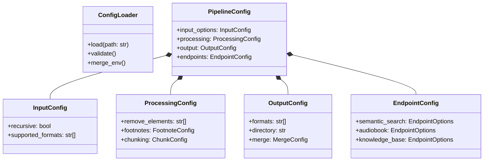

# ADR-005: Configuration Schema

## Context

Need flexible configuration for:
- Input processing options
- Chunking strategies
- Output format settings
- Directory handling
- Pipeline behavior

## Decision

Implement YAML-based configuration with environment overrides:



### Base Configuration Schema

```yaml
input:
  recursive: true
  supported_formats:
    - pdf
    - epub
    - markdown
    - txt

extraction:
  pdf:
    adobe_api:
      max_retries: 3
      retry_delay: 5
      page_limits:
        scanned: 150
        native: 400
  epub:
    preserve_structure: true
  text:
    detect_headers: true
    parse_chapters: true

content:
  remove_elements:
    - copyright
    - index
    - advertisements
  footnotes:
    include: true
    position: end  # or inline

output:
  formats:
    - markdown
    - text
    - semantic
  directory: processed/
  merge:
    strategy: semantic  # or single
    semantic_options:
      max_words_per_file: 500000
      preserve_chapters: true
```

### Endpoint-Specific Configuration

Extend the configuration with endpoint-specific options to optimize processing for different use cases:

```yaml
endpoints:
  semantic_search:
    enabled: true
    chunking:
      strategy: semantic_overlap
      max_chunk_size: 2048
      overlap_tokens: 200
    content:
      preserve_headings: true
      include_metadata: true
    analysis:
      entities: true
      keywords: true
      concepts: true
    metadata:
      include_document_structure: true
      store_embeddings: true
      vector_model: "default"
      
  audiobook:
    enabled: true
    content:
      exclude: ["footnotes", "tables", "figures"]
      include_chapter_markers: true
    text_normalization:
      abbreviation_expansion: true
      number_verbalization: true
      pronunciation_guidance: true
    chunking:
      strategy: chapter_based
      max_duration: "30m"
    voice:
      default: "neutral"
      dialog_detection: true
      
  knowledge_base:
    enabled: false
    content:
      extract_facts: true
    analysis:
      topics: true
      relationships: true
      entities: true
    chunking:
      strategy: concept_based
      link_related_chunks: true
```

## Status

Proposed

## Consequences

### Advantages
- Centralized configuration
- Environment variable override support
- Validation at startup
- Clear documentation
- Flexible customization
- Optimized processing for specific use cases
- Single configuration file for all pipeline behavior

### Disadvantages
- Need to maintain schema
- Version control for config changes
- Migration path for updates
- More complex configuration management
- Potential for configuration conflicts between endpoints

## Implementation Notes

1. Configuration Loading
   - Load from default locations
   - Override with env vars
   - Validate against schema
   - Provide migration tools

2. Environment Overrides
   ```bash
   PIPELINE_OUTPUT_DIRECTORY=custom/path/
   PIPELINE_PROCESSING_FOOTNOTES_INCLUDE=false
   PIPELINE_MERGE_STRATEGY=single
   PIPELINE_ENDPOINTS_SEMANTIC_SEARCH_ENABLED=true
   ```

3. Validation Rules
   - Required vs optional fields
   - Type checking
   - Dependency validation
   - Path verification
   - Endpoint-specific validation

4. Default Values
   ```python
   DEFAULT_CONFIG = {
       'input': {
           'recursive': True,
           'supported_formats': ['pdf', 'epub', 'md', 'txt']
       },
       'processing': {
           'footnotes': {'include': True, 'position': 'end'},
           'chunking': {'respect_toc': True}
       },
       'output': {
           'directory': 'processed/',
           'merge': {'strategy': 'semantic'}
       },
       'endpoints': {
           'semantic_search': {
               'enabled': False,
               'chunking': {
                   'strategy': 'semantic_overlap',
                   'max_chunk_size': 2048,
                   'overlap_tokens': 200
               }
           },
           'audiobook': {
               'enabled': False,
               'chunking': {
                   'strategy': 'chapter_based'
               }
           },
           'knowledge_base': {
               'enabled': False
           }
       }
   }
   ```

5. Configuration Access
   ```python
   class ConfigRegistry:
       def __init__(self, config):
           self._config = config
           
       def get_endpoint_config(self, endpoint_name):
           """Get configuration for a specific endpoint"""
           return self._config.get('endpoints', {}).get(endpoint_name, {})
           
       def is_endpoint_enabled(self, endpoint_name):
           """Check if an endpoint is enabled"""
           return self.get_endpoint_config(endpoint_name).get('enabled', False)
           
       def merge_endpoint_config(self, base_config, endpoint_name):
           """Merge base configuration with endpoint-specific overrides"""
           endpoint_config = self.get_endpoint_config(endpoint_name)
           return deep_merge(base_config, endpoint_config)
   ```

6. Processing Pipeline Integration
   ```python
   def process_document(file_path, config):
       # Get base configuration
       base_processor = create_processor(file_path, config)
       base_content = base_processor.process()
       
       results = {}
       
       # Apply endpoint-specific processing
       for endpoint in ['semantic_search', 'audiobook', 'knowledge_base']:
           if config.is_endpoint_enabled(endpoint):
               endpoint_config = config.get_endpoint_config(endpoint)
               processor = create_endpoint_processor(endpoint, endpoint_config)
               results[endpoint] = processor.process(base_content)
               
       return results
   ```