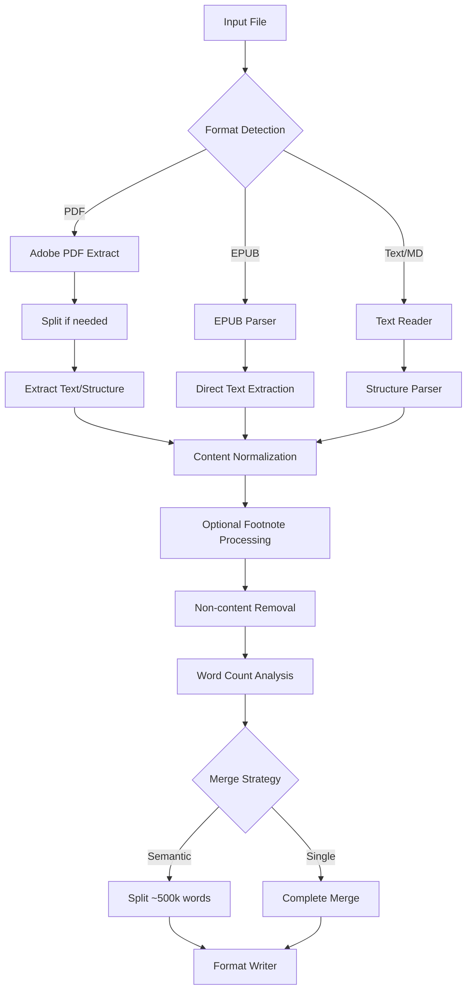

# ADR-006: Pipeline Stage Organization

## Context

Need to clarify the distinct processing stages and how configuration options affect the pipeline flow.

## Decision

Organize pipeline into clear stages with format-specific branches:



### Revised Configuration Schema

```yaml
input:
  recursive: true
  supported_formats:
    - pdf
    - epub
    - markdown
    - txt

extraction:
  pdf:
    adobe_api:
      max_retries: 3
      retry_delay: 5
      page_limits:
        scanned: 150
        native: 400
  epub:
    preserve_structure: true
  text:
    detect_headers: true
    parse_chapters: true

content:
  remove_elements:
    - copyright
    - index
    - advertisements
  footnotes:
    include: true
    position: end  # or inline

output:
  formats:
    - markdown
    - text
    - semantic
  directory: processed/
  merge:
    strategy: semantic  # or single
    semantic_options:
      max_words_per_file: 500000
      preserve_chapters: true
```

## Status

Proposed

## Consequences

### Advantages
- Clear separation of format-specific extraction
- Unified content processing pipeline
- Explicit configuration mapping to stages
- Easy to understand flow control

### Disadvantages
- More complex configuration schema
- Additional validation requirements
- Need to maintain stage separation

## Implementation Notes

1. Stage Management
   - Each stage has clear inputs/outputs
   - Format-specific branches isolated
   - Common processing unified
   - Configuration validates per stage

2. Flow Control
   ```python
   class PipelineStages:
       def extract(self, file_path: Path) -> RawContent:
           # Format-specific extraction
           
       def normalize(self, content: RawContent) -> NormalizedContent:
           # Common processing stages
           
       def output(self, content: NormalizedContent) -> None:
           # Merge and format writing
   ```

3. Configuration Impact
   - extraction.* controls format-specific tools
   - content.* applies to normalized content
   - output.* determines final processing