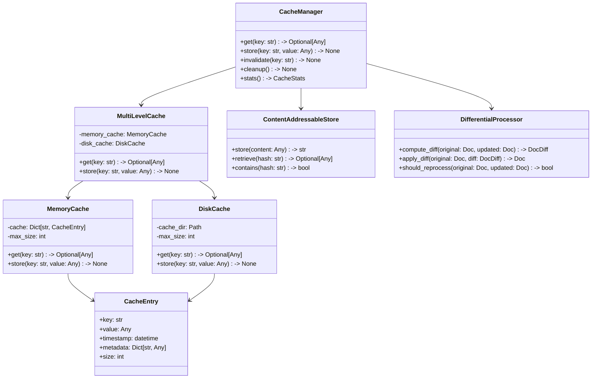

# ADR-007: Operational Concerns

## Context

Need to address:
- Error handling and recovery
- Progress tracking
- Performance optimization
- CLI interface

## Decision

### Error Handling Strategy

```mermaid
flowchart TD
    A[Error Occurs] --> B{Error Type}
    B -->|API| C[Retry Logic]
    B -->|File| D[Skip & Log]
    B -->|Pipeline| E[Halt & Report]
    
    C --> F{Retry Count}
    F -->|Exceeded| G[Fallback Strategy]
    F -->|Within Limit| H[Retry Operation]
    
    D --> I[Continue Processing]
    E --> J[Save Progress]
</mermaid>

### Progress Tracking

```mermaid
classDiagram
    class ProgressTracker {
        +start_stage(name: str)
        +update_progress(percent: float)
        +log_metrics()
    }
    
    class StageMetrics {
        +duration: float
        +items_processed: int
        +errors: List[Error]
    }
    
    class ProgressReport {
        +overall_progress: float
        +current_stage: str
        +eta: datetime
    }
    
    ProgressTracker --> StageMetrics
    ProgressTracker --> ProgressReport
```

### Advanced Caching Architecture



### Configuration Extension

```yaml
operational:
  error_handling:
    max_retries: 3
    retry_delay: 5
    fallback_strategy: skip  # or halt
    error_log: errors.log
  
  progress:
    display: rich  # or simple
    metrics_file: metrics.json
    save_interval: 60  # seconds
  
  performance:
    cache:
      enabled: true
      memory:
        enabled: true
        max_size: 500MB
      disk:
        enabled: true
        location: .cache/
        max_size: 10GB
      content_addressable:
        enabled: true
        compression: true
      differential:
        enabled: true
        compare_strategy: structure  # or content or metadata
    parallel:
      max_workers: 4
      chunk_size: 10
  
  cli:
    progress_bar: true
    verbose: false
    batch_mode: false
```

## Status

Proposed

## Consequences

### Advantages
- Robust error recovery
- Clear progress visibility
- Performance optimization
- User-friendly CLI
- Efficient resource usage
- Significant processing speed improvements
- Support for incremental processing
- Resilience to failures

### Disadvantages
- Additional complexity
- Storage overhead for caching
- More configuration to manage
- Cache invalidation challenges
- Potential memory pressure

## Implementation Notes

1. Error Recovery
   - Save state after each stage
   - Enable resume from last successful point
   - Detailed error logging
   ```python
   {
     "timestamp": "2025-03-18T02:15:00Z",
     "stage": "pdf_extraction",
     "file": "document.pdf",
     "error": "API_TIMEOUT",
     "context": {...},
     "recovery_action": "retry"
   }
   ```

2. Progress Display
   ```text
   Processing: document.pdf [===>    ] 35%
   Stage: PDF Extraction
   Files: 3/10 completed
   ETA: 5 minutes remaining
   Last Error: None
   ```

3. Advanced Cache Management
   ```python
   class MultiLevelCache:
       """Cache implementation with memory and disk layers"""
       
       def __init__(self, config):
           self.memory_cache = MemoryCache(config.memory)
           self.disk_cache = DiskCache(config.disk)
           self.content_store = ContentAddressableStore(config.content_addressable)
           
       def get(self, key):
           """Retrieve item from cache, trying memory first then disk"""
           # Try memory cache first (fastest)
           result = self.memory_cache.get(key)
           if result:
               return result
               
           # Try disk cache next
           result = self.disk_cache.get(key)
           if result:
               # Promote to memory cache for future access
               self.memory_cache.store(key, result)
               return result
               
           return None
           
       def store(self, key, value, metadata=None):
           """Store item in all cache levels"""
           # Store in content-addressable storage if enabled
           if isinstance(value, (Document, ProcessedContent)):
               content_hash = self.content_store.store(value)
               if metadata is None:
                   metadata = {}
               metadata['content_hash'] = content_hash
               
           # Store in memory and disk with metadata
           self.memory_cache.store(key, value, metadata)
           self.disk_cache.store(key, value, metadata)
           
       def invalidate(self, key):
           """Remove item from all cache levels"""
           self.memory_cache.invalidate(key)
           self.disk_cache.invalidate(key)
           
       def cleanup(self):
           """Clean up cache to stay within size limits"""
           self.memory_cache.cleanup()
           self.disk_cache.cleanup()
   ```

4. Differential Processing
   ```python
   class DifferentialProcessor:
       """Handles incremental document processing"""
       
       def compute_diff(self, original, updated):
           """Compute difference between document versions"""
           # Implementation depends on document format
           # For structured documents: compare section by section
           # For text: compute diff using text algorithms
           # Return a compact representation of changes
           pass
           
       def apply_diff(self, original, diff):
           """Apply a diff to reconstruct the updated document"""
           # Reconstruct document from original + diff
           pass
           
       def should_reprocess(self, original_doc, updated_doc):
           """Determine if a document needs reprocessing"""
           # Check if changes are significant enough to warrant reprocessing
           # For example, minor typo fixes might not need reprocessing
           # But structural changes would
           pass
           
       def optimize_processing(self, original_results, updated_doc):
           """Optimize processing by reusing parts of previous results"""
           # Identify unchanged sections that can be reused
           # Only process modified sections
           # Reassemble final result from mix of cached and fresh processing
           pass
   ```

5. Content-Addressable Storage
   ```python
   class ContentAddressableStore:
       """Store content by its hash for efficient deduplication"""
       
       def __init__(self, config):
           self.storage_path = Path(config.location)
           self.storage_path.mkdir(parents=True, exist_ok=True)
           self.use_compression = config.compression
           
       def store(self, content):
           """Store content and return its hash"""
           # Compute content hash
           content_hash = self._compute_hash(content)
           
           # Check if already stored
           if self.contains(content_hash):
               return content_hash
               
           # Store content
           path = self._get_path_for_hash(content_hash)
           self._write_content(path, content)
           
           return content_hash
           
       def retrieve(self, content_hash):
           """Retrieve content by its hash"""
           path = self._get_path_for_hash(content_hash)
           if not path.exists():
               return None
               
           return self._read_content(path)
           
       def contains(self, content_hash):
           """Check if content with given hash exists"""
           path = self._get_path_for_hash(content_hash)
           return path.exists()
           
       def _compute_hash(self, content):
           """Compute stable hash of content"""
           # Use appropriate serialization and hashing
           # for different content types
           pass
           
       def _get_path_for_hash(self, content_hash):
           """Convert hash to filesystem path"""
           # Use hierarchical structure to avoid too many
           # files in one directory
           pass
           
       def _write_content(self, path, content):
           """Write content to disk, with optional compression"""
           pass
           
       def _read_content(self, path):
           """Read content from disk, with optional decompression"""
           pass
   ```

6. Resumable Processing
   ```python
   class ResumableProcessor:
       """Handles resumable document processing"""
       
       def __init__(self, checkpoint_file=None):
           self.checkpoint_file = checkpoint_file
           self.progress = self._load_progress()
           
       def process_batch(self, files):
           """Process a batch of files with resumability"""
           for file in files:
               if self._is_completed(file):
                   print(f"Skipping {file} (already processed)")
                   continue
                   
               try:
                   self._process_file(file)
                   self._mark_completed(file)
               except Exception as e:
                   self._mark_failed(file, e)
                   if not self._should_continue():
                       break
                       
               self._save_progress()
               
       def _is_completed(self, file):
           """Check if file was already processed"""
           return file in self.progress.get('completed', [])
           
       def _mark_completed(self, file):
           """Mark file as successfully processed"""
           if 'completed' not in self.progress:
               self.progress['completed'] = []
           self.progress['completed'].append(file)
           
       def _mark_failed(self, file, error):
           """Mark file as failed with error info"""
           if 'failed' not in self.progress:
               self.progress['failed'] = {}
           self.progress['failed'][file] = {
               'error': str(error),
               'timestamp': datetime.now().isoformat()
           }
           
       def _save_progress(self):
           """Save current progress to checkpoint file"""
           if self.checkpoint_file:
               with open(self.checkpoint_file, 'w') as f:
                   json.dump(self.progress, f)
                   
       def _load_progress(self):
           """Load progress from checkpoint file if it exists"""
           if self.checkpoint_file and os.path.exists(self.checkpoint_file):
               with open(self.checkpoint_file) as f:
                   return json.load(f)
           return {}
           
       def _should_continue(self):
           """Determine if processing should continue after error"""
           # Implementation based on configuration
           pass
   ```