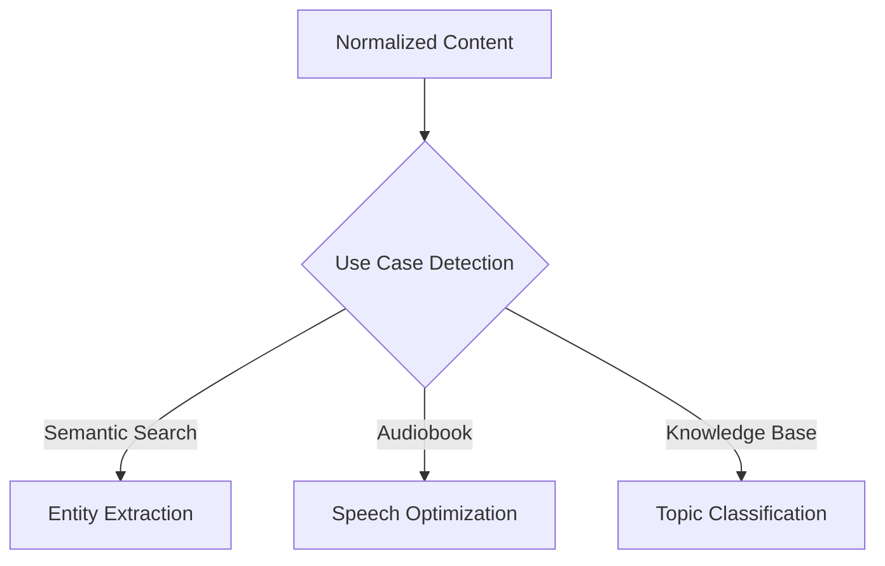

# ADR-008: Domain-Specific Content Processing

## Context

Different downstream applications (semantic search, audiobook generation, knowledge base integration) have unique requirements for processed content. A single output format doesn't optimize for all use cases.

## Decision

Implement an extensible post-processing system with domain-specific transformers:



### Key Components

1. Use Case Registry
   - Plugin system for registering domain processors
   - Configuration-driven processing paths
   - Chaining support for multiple transformations

2. Semantic Search Optimization
   - Named entity recognition and extraction
   - Keyword density analysis
   - Semantic chunking with overlaps
   - Vector embedding preparation

3. Audiobook Preparation
   - Text normalization for TTS engines
   - Abbreviation expansion
   - Number verbalization
   - Proper noun pronunciation guidance
   - Dialogue identification

4. Knowledge Base Integration
   - Topic classification
   - Concept mapping
   - Relationship extraction
   - Fact isolation
   - Cross-document linking

### Configuration Schema

```yaml
domain_processors:
  semantic_search:
    enabled: true
    entity_extraction: true
    chunk_overlap: 200
    embedding_model: default
    
  audiobook:
    enabled: true
    text_normalization:
      abbreviation_expansion: true
      number_verbalization: true
      pronunciation_guidance: true
    structural:
      chapter_boundaries: true
      dialog_markers: true
      
  knowledge_base:
    enabled: false
    topic_extraction: true
    fact_isolation: true
    concept_mapping: true
```

## Status

Proposed

## Consequences

### Advantages
- Optimized content for each use case
- Flexible configuration per document set
- Extensible for new downstream applications
- Clear separation of normalization and domain-specific processing

### Disadvantages
- Increased pipeline complexity
- Multiple output variations to manage
- Additional processing time
- Domain-specific expertise required

## Implementation Notes

1. Post-Processor Interface
   ```python
   class DomainProcessor:
       """Base class for domain-specific processors"""
       
       def configure(self, config: dict) -> None:
           """Configure the processor with domain-specific options"""
           
       def process(self, content: NormalizedContent) -> DomainContent:
           """Transform content for specific domain use"""
           
       @property
       def domain_name(self) -> str:
           """Return the name of this domain processor"""
   ```

2. Domain Content Model
   ```python
   class DomainContent:
       """Base class for domain-specific content"""
       
       content: Any  # Domain-specific content representation
       metadata: Dict[str, Any]  # Domain-specific metadata
       source: NormalizedContent  # Reference to source content
       transformations: List[str]  # List of applied transformations
   ```

3. Processor Registration
   ```python
   # Example registration
   domain_registry = DomainProcessorRegistry()
   domain_registry.register("semantic_search", SemanticSearchProcessor())
   domain_registry.register("audiobook", AudiobookProcessor())
   domain_registry.register("knowledge_base", KnowledgeBaseProcessor())
   ```