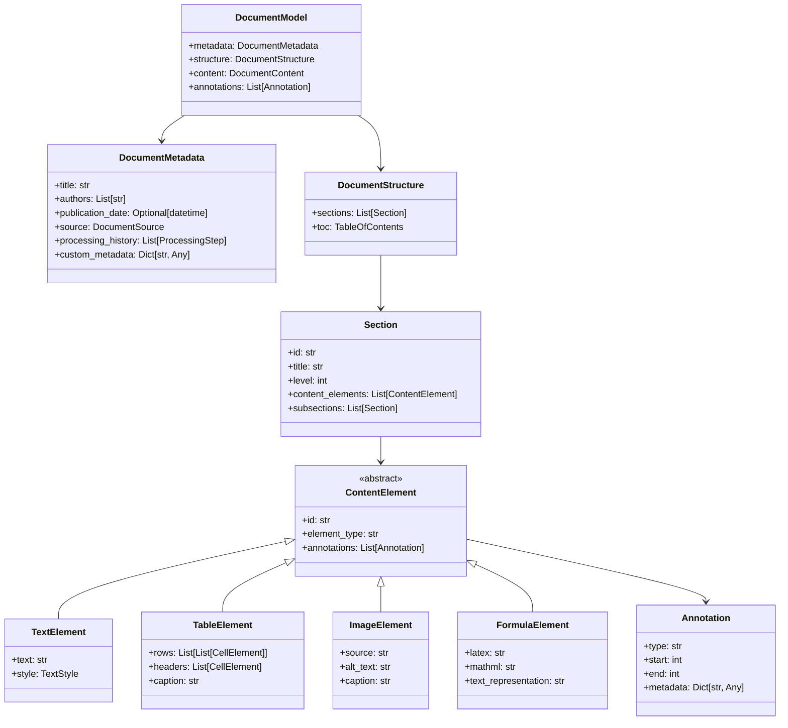

# ADR-009: Standardized Document Interchange Format

## Context

Processing documents from multiple formats (PDF, EPUB, Markdown, Text) into multiple output formats requires a consistent intermediate representation. Current implementations often convert directly between specific input/output formats, leading to code duplication and inconsistent output.

## Decision

Implement a standardized Document Object Model (DOM) to serve as the intermediate representation for all document processing:



### Document Interchange Format

1. **JSON Schema Definition**
```json
{
  "$schema": "http://json-schema.org/draft-07/schema#",
  "type": "object",
  "properties": {
    "metadata": {
      "type": "object",
      "properties": {
        "title": { "type": "string" },
        "authors": { "type": "array", "items": { "type": "string" } },
        "publication_date": { "type": ["string", "null"], "format": "date-time" },
        "source": {
          "type": "object",
          "properties": {
            "type": { "type": "string", "enum": ["pdf", "epub", "markdown", "text"] },
            "path": { "type": "string" },
            "id": { "type": "string" }
          },
          "required": ["type", "path"]
        },
        "processing_history": {
          "type": "array",
          "items": {
            "type": "object",
            "properties": {
              "step": { "type": "string" },
              "timestamp": { "type": "string", "format": "date-time" },
              "processor": { "type": "string" },
              "version": { "type": "string" }
            }
          }
        },
        "custom_metadata": {
          "type": "object"
        }
      },
      "required": ["title", "source"]
    },
    "structure": {
      "type": "object",
      "properties": {
        "sections": {
          "type": "array",
          "items": { "$ref": "#/definitions/section" }
        },
        "toc": {
          "type": "object",
          "properties": {
            "entries": {
              "type": "array",
              "items": {
                "type": "object",
                "properties": {
                  "title": { "type": "string" },
                  "section_id": { "type": "string" },
                  "level": { "type": "integer", "minimum": 0 },
                  "children": { "type": "array" }
                }
              }
            }
          }
        }
      }
    },
    "content": {
      "type": "array",
      "items": { "$ref": "#/definitions/content_element" }
    },
    "annotations": {
      "type": "array",
      "items": { "$ref": "#/definitions/annotation" }
    }
  },
  "required": ["metadata", "structure", "content"],
  "definitions": {
    "section": {
      "type": "object",
      "properties": {
        "id": { "type": "string" },
        "title": { "type": "string" },
        "level": { "type": "integer", "minimum": 0 },
        "content_elements": {
          "type": "array",
          "items": { "$ref": "#/definitions/content_element" }
        },
        "subsections": {
          "type": "array",
          "items": { "$ref": "#/definitions/section" }
        }
      },
      "required": ["id", "level", "content_elements"]
    },
    "content_element": {
      "type": "object",
      "oneOf": [
        { "$ref": "#/definitions/text_element" },
        { "$ref": "#/definitions/table_element" },
        { "$ref": "#/definitions/image_element" },
        { "$ref": "#/definitions/formula_element" },
        { "$ref": "#/definitions/code_element" }
      ]
    },
    "text_element": {
      "type": "object",
      "properties": {
        "id": { "type": "string" },
        "element_type": { "type": "string", "enum": ["text"] },
        "text": { "type": "string" },
        "style": {
          "type": "object",
          "properties": {
            "bold": { "type": "boolean" },
            "italic": { "type": "boolean" },
            "underline": { "type": "boolean" },
            "font_size": { "type": ["number", "null"] },
            "font_family": { "type": ["string", "null"] }
          }
        },
        "annotations": {
          "type": "array",
          "items": { "$ref": "#/definitions/annotation" }
        }
      },
      "required": ["id", "element_type", "text"]
    },
    "table_element": {
      "type": "object",
      "properties": {
        "id": { "type": "string" },
        "element_type": { "type": "string", "enum": ["table"] },
        "rows": {
          "type": "array",
          "items": {
            "type": "array",
            "items": { "$ref": "#/definitions/cell_element" }
          }
        },
        "headers": {
          "type": "array",
          "items": { "$ref": "#/definitions/cell_element" }
        },
        "caption": { "type": "string" },
        "annotations": {
          "type": "array",
          "items": { "$ref": "#/definitions/annotation" }
        }
      },
      "required": ["id", "element_type", "rows"]
    },
    "cell_element": {
      "type": "object",
      "properties": {
        "id": { "type": "string" },
        "content": { "type": "string" },
        "colspan": { "type": "integer", "minimum": 1 },
        "rowspan": { "type": "integer", "minimum": 1 },
        "annotations": {
          "type": "array",
          "items": { "$ref": "#/definitions/annotation" }
        }
      },
      "required": ["id", "content"]
    },
    "image_element": {
      "type": "object",
      "properties": {
        "id": { "type": "string" },
        "element_type": { "type": "string", "enum": ["image"] },
        "source": { "type": "string" },
        "alt_text": { "type": "string" },
        "caption": { "type": "string" },
        "annotations": {
          "type": "array",
          "items": { "$ref": "#/definitions/annotation" }
        }
      },
      "required": ["id", "element_type", "source"]
    },
    "formula_element": {
      "type": "object",
      "properties": {
        "id": { "type": "string" },
        "element_type": { "type": "string", "enum": ["formula"] },
        "latex": { "type": "string" },
        "mathml": { "type": "string" },
        "text_representation": { "type": "string" },
        "annotations": {
          "type": "array",
          "items": { "$ref": "#/definitions/annotation" }
        }
      },
      "required": ["id", "element_type"]
    },
    "code_element": {
      "type": "object",
      "properties": {
        "id": { "type": "string" },
        "element_type": { "type": "string", "enum": ["code"] },
        "code": { "type": "string" },
        "language": { "type": "string" },
        "annotations": {
          "type": "array",
          "items": { "$ref": "#/definitions/annotation" }
        }
      },
      "required": ["id", "element_type", "code"]
    },
    "annotation": {
      "type": "object",
      "properties": {
        "type": { "type": "string" },
        "start": { "type": "integer" },
        "end": { "type": "integer" },
        "metadata": { "type": "object" }
      },
      "required": ["type", "start", "end"]
    }
  }
}
```

## Status

Proposed

## Consequences

### Advantages
- Consistent document representation across formats
- Clear separation of structure and content
- Support for rich document features
- Single point of enhancement for all formats
- Consistent handling of rich media content
- Annotation layer supports multiple enrichment passes
- Strong typing for document elements
- Bidirectional traceability through processing

### Disadvantages
- Initial development overhead
- Increased memory footprint for document representation
- Need for conversion to/from all supported formats
- Potential performance impact for simple formats
- More complex schema validation

## Implementation Notes

1. Core Document Model
   ```python
   class DocumentModel:
       """Standard document interchange format for the pipeline"""
       
       def __init__(self):
           self.metadata = DocumentMetadata()
           self.structure = DocumentStructure()
           self.content = []  # List of ContentElements
           self.annotations = []  # List of Annotations
           
       @classmethod
       def from_json(cls, json_str):
           """Create a DocumentModel from JSON string"""
           # Implementation
           
       def to_json(self):
           """Convert to JSON string"""
           # Implementation
           
       def add_processing_step(self, step_name, processor_name, version):
           """Record a processing step in document history"""
           step = {
               "step": step_name,
               "timestamp": datetime.now().isoformat(),
               "processor": processor_name,
               "version": version
           }
           self.metadata.processing_history.append(step)
           
       def validate(self):
           """Validate document model integrity"""
           # Check for mandatory fields
           # Validate structure references
           # Ensure all section and element IDs are unique
           # Return list of validation errors
   ```

2. Converters
   ```python
   class PDFToDocumentModel:
       """Convert PDF extraction results to document model"""
       
       def convert(self, pdf_content):
           """Convert PDF content to document model"""
           model = DocumentModel()
           
           # Extract metadata
           model.metadata.title = pdf_content.get('title', '')
           # ... more metadata extraction
           
           # Build document structure
           structure = self._build_structure(pdf_content)
           model.structure = structure
           
           # Convert content
           content_elements = self._extract_content_elements(pdf_content)
           model.content = content_elements
           
           # Extract annotations
           annotations = self._extract_annotations(pdf_content)
           model.annotations = annotations
           
           return model
           
       def _build_structure(self, pdf_content):
           """Extract document structure from PDF content"""
           # Implementation
           
       def _extract_content_elements(self, pdf_content):
           """Extract content elements from PDF content"""
           # Implementation
           
       def _extract_annotations(self, pdf_content):
           """Extract annotations from PDF content"""
           # Implementation
   ```

3. Output Generation
   ```python
   class DocumentModelToMarkdown:
       """Convert document model to Markdown"""
       
       def convert(self, model):
           """Convert document model to Markdown string"""
           output = []
           
           # Add title
           if model.metadata.title:
               output.append(f"# {model.metadata.title}\n")
           
           # Add metadata section if configured
           if self.include_metadata:
               output.append(self._format_metadata(model.metadata))
           
           # Process sections
           for section in model.structure.sections:
               output.append(self._process_section(section))
           
           return "\n".join(output)
           
       def _process_section(self, section, level=0):
           """Process a section and its content"""
           # Implementation
           
       def _format_content_element(self, element):
           """Format a content element as Markdown"""
           # Implementation based on element type
   ```

4. Annotation Processing
   ```python
   class AnnotationProcessor:
       """Process document annotations"""
       
       def process(self, document_model):
           """Process annotations in the document model
           
           This can enrich the document with additional
           information based on annotations.
           """
           # Group annotations by type
           annotations_by_type = {}
           for annotation in document_model.annotations:
               if annotation.type not in annotations_by_type:
                   annotations_by_type[annotation.type] = []
               annotations_by_type[annotation.type].append(annotation)
           
           # Process each annotation type
           for annotation_type, annotations in annotations_by_type.items():
               processor = self._get_processor_for_type(annotation_type)
               if processor:
                   processor.process(document_model, annotations)
           
       def _get_processor_for_type(self, annotation_type):
           """Get appropriate processor for annotation type"""
           # Implementation
   ```

5. Document Validation
   ```python
   class DocumentModelValidator:
       """Validate document model integrity"""
       
       def validate(self, document_model):
           """Validate document model and return errors"""
           errors = []
           
           # Validate metadata
           errors.extend(self._validate_metadata(document_model.metadata))
           
           # Validate structure
           errors.extend(self._validate_structure(document_model.structure))
           
           # Validate content elements
           errors.extend(self._validate_content_elements(document_model.content))
           
           # Validate annotations
           errors.extend(self._validate_annotations(document_model.annotations))
           
           # Validate references
           errors.extend(self._validate_references(document_model))
           
           return errors
   ```